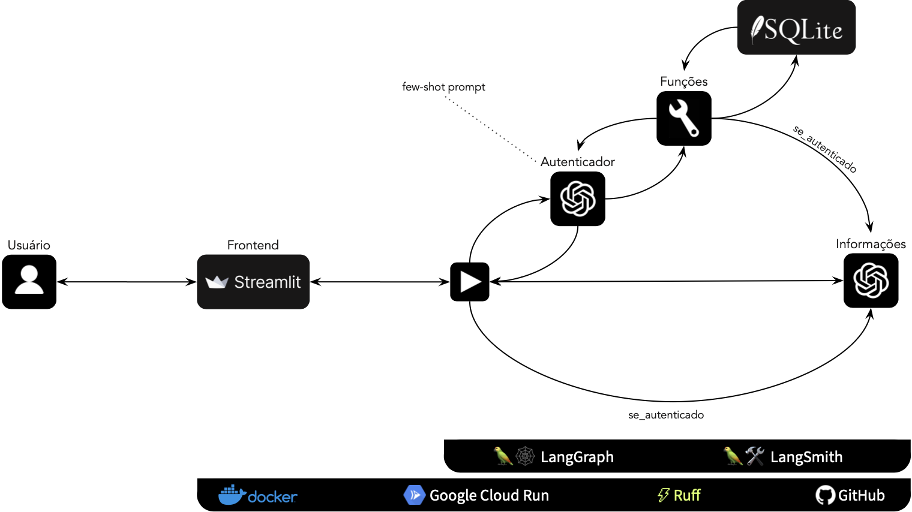

# Chatbot com IA: assistente de dívidas
[Link para interagir com o chatbot](https://ai-assistant-debt-fpz2xygraa-rj.a.run.app)

## 👨🏻‍🏫 Descrição
Projeto de chatbot de atendimento ao consumidor para uma empresa de negociação de dívidas utilizando inteligência artificial O **objetivo** principal do desenvolvimento foi direcionado para habilitar esse chatbot a autenticar um usuário e apresentar suas dívidas e opções de pagamento a partir de uma base de dados.

## 🏛️ Arquitetura
- Backend
  - Python (linguagem de programação)
  - LangGraph (modelagem e arquitetura)
  - LangSmith (monitoramento)
  - SQLite (base de dados)
- Frontend
  - Docker (conteinerização)
  - Streamlit (Interface com o chatbot)
  - Google Cloud Run (implantação pública)
- Extras
  - Ruff (linting e formatação)
  - GitHub (gerenciamento de repositório)

O funcionamento do chatbot é apresentado no diagrama abaixo: \

## 📁 Repositório
    ├── app                <- Python scripts for both backend and frontend.
    │
    ├── data
    │   ├── databases      <- sqlite files containing debt information and memory-state for LangGraph
    │   └── raw            <- The original, immutable data dump.
    │
    ├── notebooks          <- Jupyter notebooks used during the development
    │
    ├── resources          <- figures, images, manuals, and all other explanatory materials.
    │
    ├── secrets            <- a folder to keep secrets (like .env) on json credentials for service accounts for deployment
    │
    ├── .dockerignore      <- Files not to be included on the Docker image.
    ├── .gitignore         <- Files not to be included on GitHub repo
    ├── Dockerfile         <- Docker instructions to build image of the project.
    ├── LICENSE            <- Licensing rights.
    ├── README.md          <- Top-level README for developers.
    ├── requirements.txt   <- The requirements file for reproducing the project.