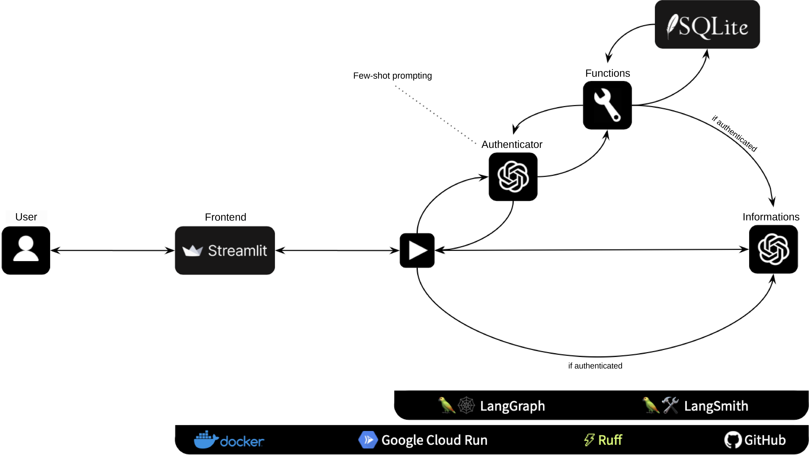

# AI Agent - Debt Information Assistant

*Creating an AI Agent to retrieve debt information for customers*

## 📖 Project

### 👨🏻‍🏫 Introduction

This project demonstrates the development of an **AI Agent Chatbot** designed to assist customers of a brazilian debt negotiation company. The chatbot interact with the customer in brazilian portuguese and is capable of authenticating them to a database and presenting information about their debts.

Link to interact with the chatbot [HERE](https://ai-assistant-debt-fpz2xygraa-rj.a.run.app).

The project was developed using [TDSP](https://learn.microsoft.com/en-us/azure/architecture/data-science-process/overview) framework and includes the following files (in Brazilian Portuguese):
- [Project Planning File](https://docs.google.com/document/d/1KjYd8HR94FH1ZMoEWxI6SCZ_lVyIvGIF_7jPZDHtk9c/edit?tab=t.0), containing information about the planning, testing, technologies and decision-making process.
- [Project Presentation](https://docs.google.com/presentation/d/1SwAivlGW-JY7K1KCBE56eMsO9HwCef_oI5Y4f8OcEds/edit#slide=id.g2152b81b697_1_0), containing the slide deck for the project presentation.

### 🎯 Goal

The Agent must be able to:
- Present itself.
- Request the customer's CPF (unique ID) and date of birth.
- Validate the customer's CPF in the database.
- Provide information to the customer regarding their debt.

More information about the project planning, including the framework, technologies and decision making in the

### 🏛️ Achitecture

- Backend
  - Python (programming language)
  - LangGraph (AI Agent framework)
  - LangSmith (production monitoring)
  - SQLite (database)
- Frontend
  - Docker (containerization)
  - Streamlit (chatbot interface)
  - Google Cloud Run (serverless deploy)
- Extras
  - Ruff (linting and formatting)
  - GitHub (repository management)

## 🗺 AI Agent Diagram

## 📦 Folder Structure

    ├── app                <- Python scripts for both backend and frontend.
    │
    ├── data
    │   ├── databases      <- sqlite files containing debt information and memory-state for LangGraph
    │   └── raw            <- The original, immutable data dump.
    │
    ├── notebooks          <- Jupyter notebooks used during the development
    │
    ├── resources          <- figures, images, manuals, and all other explanatory materials.
    │
    ├── secrets            <- a folder to keep secrets (like .env) on json credentials for service accounts for deployment
    │
    ├── .dockerignore      <- Files not to be included on the Docker image.
    ├── .gitignore         <- Files not to be included on GitHub repo
    ├── Dockerfile         <- Docker instructions to build the image of the project.
    ├── LICENSE            <- Licensing rights.
    ├── README.md          <- Top-level README for developers.
    ├── requirements.txt   <- The requirements file for reproducing the project.
